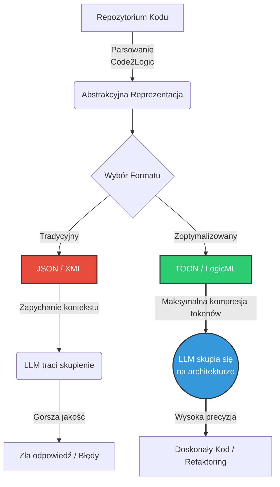
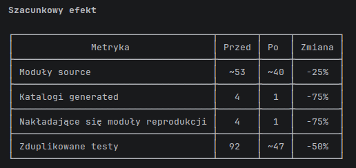
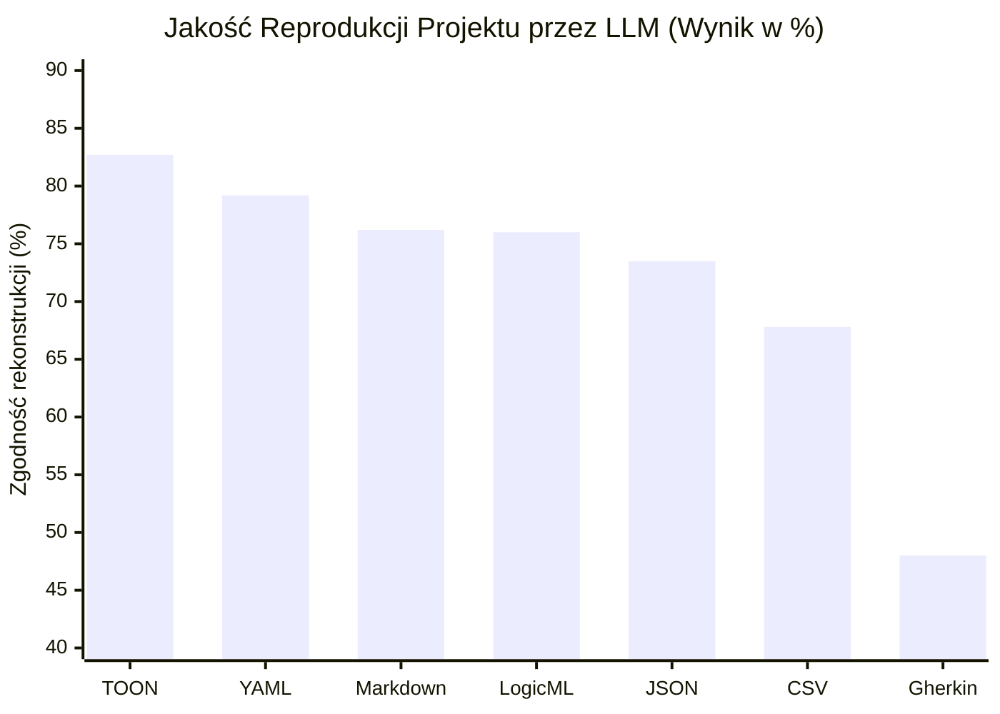

# LLM i limit kontekstu: Dlaczego JSON to ślepa uliczka i jak Code2Logic zmienia zasady gry

**Autor: Tom Sapletta**

Jeśli kiedykolwiek próbowałeś "nakarmić" model językowy (LLM) całym repozytorium kodu, by poprosić go o refaktoryzację, znalezienie błędu czy wygenerowanie dokumentacji, na pewno zderzyłeś się ze ścianą. Ścianą tą jest limit okna kontekstowego oraz zjawisko znane jako *lost in the middle* – model zapomina lub ignoruje informacje znajdujące się w środku długiego promptu. 

W tym artykule pokazuję wyniki benchmarków jakości *rekonstrukcji* kodu na podstawie specyfikacji. To ważne rozróżnienie: **wysoki wynik benchmarku nie jest dowodem równoważności behawioralnej (runtime)** — mierzymy tu głównie zgodność struktury i semantyki tekstowej (np. klasy/funkcje/sygnatury/nazewnictwo), a pełną poprawność potwierdza dopiero uruchomienie testów.

Cześć, jestem Tom Sapletta i od dłuższego czasu pracuję nad tym, 
jak zoptymalizować komunikację między kodem źródłowym a sztuczną inteligencją. 
Tak właśnie narodził się projekt **Code2Logic**.

## Dlaczego powstał Code2Logic?

Kiedy LLM analizuje nasz kod, nie potrzebuje wszystkich średników, nawiasów, wcięć ani nadmiarowej struktury danych. Tradycyjne podejście polega na serializacji struktury projektu do formatu JSON. Niestety, JSON jest dla LLM-ów "głośny". 

Spójrzmy na to zjawisko wizualnie:

```text
+-----------------------------------+   +-----------------------+
|  Tradycyjny JSON (Duży szum)      |   |  Format TOON (Czysto) |
|-----------------------------------|   |-----------------------|
| {                                 |   | classes:              |
|   "User": {                       |   |   User                |
|     "methods": [                  |   |     - get_email()     |
|       {                           |   |     - set_email(e)    |
|         "name": "get_email",      |   |                       |
|         "type": "string"          |   |                       |
|       }                           |   |                       |
|     ]                             |   |                       |
|   }                               |   |                       |
| }                                 |   |                       |
+-----------------------------------+   +-----------------------+
```

W formacie JSON większość tokenów, za które płacimy (i które marnują "uwagę" modelu), to nawiasy klamrowe, cudzysłowy i powtarzające się klucze. Code2Logic powstał po to, aby wyekstrahować **czystą logikę** z kodu i przekazać ją do modelu w maksymalnie skompresowanych formatach, takich jak nasz autorski **TOON** czy **LogicML**.

Poniższy diagram obrazuje, jak Code2Logic zmienia architekturę przepływu danych:



## Fascynujące rezultaty benchmarków

Zbudowałem w pełni zautomatyzowane środowisko testowe, które sprawdza, jak LLM (np. `google/gemini-3-flash-preview`) radzi sobie z rekonstrukcją kodu na podstawie różnych specyfikacji. Otrzymane wyniki przerosły moje oczekiwania i jednoznacznie pokazały, że format ma znaczenie.

Oto co odkryliśmy w trakcie naszych najnowszych benchmarków na próbie 20 plików:

### 1. Kolosalna różnica w rozmiarze i tokenach
Zrzut struktury tego samego projektu waży:
* **JSON:** ~918 KB (~235 000 tokenów)
* **TOON:** ~170 KB (~43 000 tokenów)

Zredukowaliśmy objętość ponad 5-krotnie! Oznacza to, że do kontekstu modelu jesteśmy w stanie zmieścić 5 razy większy projekt, płacąc ułamek oryginalnej ceny.

#### Przykład Claude Code

**Krok 1: Wygeneruj manifest function-logic (TOON)**

```bash
code2logic ./ -f toon --compact --no-repeat-module --function-logic -o ./
```

**Krok 2: Użyj manifestu w promptie Claude (wersja prosta)**

```bash
claude --dangerously-skip-permissions -p "Zrób refaktoryzacje projektu, wykorzystaj plik indeksu project.functions.toon"
```

**Krok 3: Pełne rozwiązanie z dołączaniem treści do promptu (najpewniejsze)**

```bash
# Metoda A: Użyj heredoc (działa dla dużych plików)
claude --dangerously-skip-permissions << 'EOF'
Zrób refaktoryzację projektu. Poniżej masz manifest function-logic w formacie TOON. Użyj go jako źródła prawdy. Zwróć plan zmian + listę plików do edycji.

$(cat ./project.functions.toon)
EOF
```
#### Start komendy z Claude 


#### Wnioski Claude


#### Szacunki



```bash
# Metoda B: Zapisz do pliku tymczasowego (jeśli heredoc nie działa)
printf '%s\n\n' "Zrób refaktoryzację projektu. Poniżej masz manifest function-logic w formacie TOON. Użyj go jako źródło prawdy. Zwróć plan zmian + listę plików do edycji." > /tmp/prompt.txt
cat ./project.functions.toon >> /tmp/prompt.txt
claude --dangerously-skip-permissions --file /tmp/prompt.txt
```

### 2. LLM lepiej rozumie skompresowaną wiedzę
Mogłoby się wydawać, że JSON, jako standard branżowy, będzie najbardziej zrozumiały dla maszyny. Prawda jest jednak inna. Brak redundancji w formacie TOON sprawia, że LLM znacznie rzadziej się "gubi".

Wyniki z naszego *Project Benchmark* (Zdolność LLM do odtworzenia poprawnego strukturalnie i semantycznie kodu na bazie specyfikacji):



Format **TOON uzyskał imponujące 82.7%**, zostawiając JSON (73.5%) daleko w tyle. Jeszcze ciekawszy jest **LogicML**, który zużywa średnio zaledwie 245 tokenów na plik (10-krotnie mniej niż JSON!), a nadal utrzymuje wynik powyżej 76%.

## Wnioski i wyzwania na przyszłość

Dane z benchmarków pokazały nam drogę, ale obnażyły też obszary do natychmiastowej poprawy:

1. **Przejście z heurystyk (Regex) na AST (Abstract Syntax Tree):**  
   Obecny benchmark świetnie radzi sobie z Pythonem, ale traci skuteczność przy ocenie rekonstrukcji w JavaScripcie, Javie czy Rust (często oceniając wygenerowane struktury na 0%). Wdrożenie parserów opartych na AST sprawi, że metryki będą w 100% niezależne od języka, a ewaluacja struktury (klasy, funkcje) nie będzie mylona z różnicami w formatowaniu tekstu.

2. **Głębsza reprodukcja logiki funkcji:**  
   O ile ogólna architektura klas odtwarza się na poziomie ~82%, o tyle rekonstrukcja wewnętrznej logiki ukrytej *w ciałach funkcji* nadal oscyluje wokół 38.5%. Rozwiązaniem, które właśnie testujemy, jest równoległe dołączanie pliku `project.functions.toon`, który w kompresowanym formacie wstrzykuje informacje o przepływie danych wewnątrz metod.

## Podsumowanie

Przekładanie całego repozytorium do formatu JSON, by porozmawiać z LLM-em o architekturze, to ślepa uliczka zjadająca budżet i precyzję. **Code2Logic** udowadnia, że kluczem do lepszych wyników AI nie zawsze jest większy lub droższy model – częściej jest nim po prostu podanie mu wiedzy w lepszym, "czystszym" formacie bez zbędnego szumu.

Dalszy rozwój projektu to pełna abstrakcja języków poprzez AST i poprawa ewaluacji behawioralnej. Przed nami jeszcze sporo pracy, ale już teraz TOON i LogicML mogą uratować Wasze portfele i nerwy.

---
*Jeśli interesuje Cię, jak optymalizować pracę sztucznej inteligencji z kodem,
sprawdź [repozytorium projektu Code2Logic](http://github.com/wronai/code2logic) na GitHubie!*