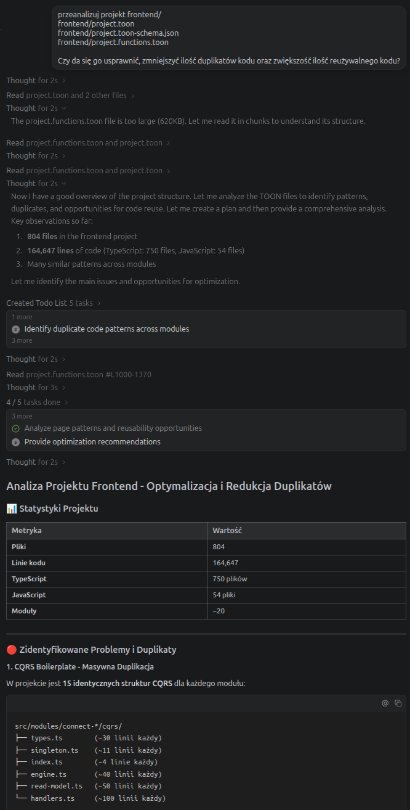
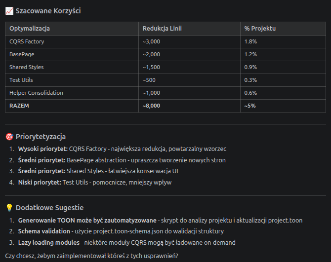

# Code2Logic

[](https://badge.fury.io/py/code2logic)
[](https://www.python.org/downloads/)
[](https://www.apache.org/licenses/LICENSE-2.0)

**Convert source code to logical representation for LLM analysis.**

Code2Logic analyzes codebases and generates compact, LLM-friendly representations with semantic understanding.
Perfect for feeding project context to AI assistants, building code documentation, or analyzing code structure.

## ✨ Features

- 🌳 **Multi-language support** - Python, JavaScript, TypeScript, Java, Go, Rust, and more
- 🎯 **Tree-sitter AST parsing** - 99% accuracy with graceful fallback
- 📊 **NetworkX dependency graphs** - PageRank, hub detection, cycle analysis
- 🔍 **Rapidfuzz similarity** - Find duplicate and similar functions
- 🧠 **NLP intent extraction** - Human-readable function descriptions
- 📦 **Zero dependencies** - Core works without any external libs

## 🚀 Installation

### Basic (no dependencies)

```bash
pip install code2logic
```

### Full (all features)

```bash
pip install code2logic[full]
```

### Selective features

```bash
pip install code2logic[treesitter]  # High-accuracy AST parsing
pip install code2logic[graph]       # Dependency analysis
pip install code2logic[similarity]  # Similar function detection
pip install code2logic[nlp]         # Enhanced intents
```

## 📖 Quick Start

### Command Line

```bash
# Standard Markdown output
code2logic /path/to/project

# Compact YAML (14% smaller, meta.legend transparency)
code2logic /path/to/project -f yaml --compact -o analysis-compact.yaml

# Ultra-compact TOON (71% smaller, single-letter keys)
code2logic /path/to/project -f toon --ultra-compact -o analysis-ultra.toon

# Generate schema alongside output
code2logic /path/to/project -f yaml --compact --with-schema

# With detailed analysis
code2logic /path/to/project -d detailed
```


### Python API

```python
from code2logic import analyze_project, MarkdownGenerator

# Analyze a project
project = analyze_project("/path/to/project")

# Generate output
generator = MarkdownGenerator()
output = generator.generate(project, detail_level='standard')
print(output)

# Access analysis results
print(f"Files: {project.total_files}")
print(f"Lines: {project.total_lines}")
print(f"Languages: {project.languages}")

# Get hub modules (most important)
hubs = [p for p, n in project.dependency_metrics.items() if n.is_hub]
print(f"Key modules: {hubs}")
```

### Organized Imports

```python
# Core analysis
from code2logic.core import ProjectInfo, ProjectAnalyzer, analyze_project

# Format generators
from code2logic.formats import (
    YAMLGenerator, JSONGenerator, TOONGenerator,
    LogicMLGenerator, GherkinGenerator
)

# LLM clients
from code2logic.llm import get_client, BaseLLMClient

# Development tools
from code2logic.tools import run_benchmark, CodeReviewer
```

## 📋 Output Formats

### Markdown (default)

Human-readable documentation with:

- Project structure tree with hub markers (★)
- Dependency graphs with PageRank scores
- Classes with methods and intents
- Functions with signatures and descriptions

### Compact

Ultra-compact format optimized for LLM context:

```text
# myproject | 102f 31875L | typescript:79/python:23
ENTRY: index.ts main.py
HUBS: evolution-manager llm-orchestrator

[core/evolution]
  evolution-manager.ts (3719L) C:EvolutionManager | F:createEvolutionManager
  task-queue.ts (139L) C:TaskQueue,Task
```

### JSON

Machine-readable format for:

- RAG (Retrieval-Augmented Generation)
- Database storage
- Further analysis

## 🔧 Configuration

### Library Status

Check which features are available:

```bash
code2logic --status
```

```text
Library Status:
  tree_sitter: ✓
  networkx: ✓
  rapidfuzz: ✓
  nltk: ✗
  spacy: ✗
```

### LLM Configuration

Manage LLM providers, models, API keys, and routing priorities:

```bash
code2logic llm status
code2logic llm set-provider auto
code2logic llm set-model openrouter nvidia/nemotron-3-nano-30b-a3b:free
code2logic llm key set openrouter <OPENROUTER_API_KEY>
code2logic llm priority set-provider openrouter 10
code2logic llm priority set-mode provider-first
code2logic llm priority set-llm-model nvidia/nemotron-3-nano-30b-a3b:free 5
code2logic llm priority set-llm-family nvidia/ 5
code2logic llm config list
```

Notes:

- `code2logic llm set-provider auto` enables automatic fallback selection: providers are tried in priority order.
- API keys should be stored in `.env` (or environment variables), not in `litellm_config.yaml`.
- These commands write configuration files:
  - `.env` in the current working directory
  - `litellm_config.yaml` in the current working directory
  - `~/.code2logic/llm_config.json` in your home directory

#### Priority modes

You can choose how automatic fallback ordering is computed:

- `provider-first`
  providers are ordered by provider priority (defaults + overrides)
- `model-first`
  providers are ordered by priority rules for the provider's configured model (exact/prefix)
- `mixed`
  providers are ordered by the best (lowest) priority from either provider priority or model rules

Configure the mode:

```bash
code2logic llm priority set-mode provider-first
code2logic llm priority set-mode model-first
code2logic llm priority set-mode mixed
```

Model priority rules are stored in `~/.code2logic/llm_config.json`.

### Python API (Library Status)

```python
from code2logic import get_library_status

status = get_library_status()
# {'tree_sitter': True, 'networkx': True, ...}
```

## 📊 Analysis Features

### Dependency Analysis

- **PageRank** - Identifies most important modules
- **Hub detection** - Central modules marked with ★
- **Cycle detection** - Find circular dependencies
- **Clustering** - Group related modules

### Intent Generation

Functions get human-readable descriptions:

```yaml
methods:
  async findById(id:string) -> Promise<User>  # retrieves user by id
  async createUser(data:UserDTO) -> Promise<User>  # creates user
  validateEmail(email:string) -> boolean  # validates email
```

### Similarity Detection

Find duplicate and similar functions:

```yaml
Similar Functions:
  core/auth.ts::validateToken:
    - python/auth.py::validate_token (92%)
    - services/jwt.ts::verifyToken (85%)
```

## 🏗️ Architecture

```text
code2logic/
├── analyzer.py      # Main orchestrator
├── parsers.py       # Tree-sitter + fallback parser
├── dependency.py    # NetworkX dependency analysis
├── similarity.py    # Rapidfuzz similar detection
├── intent.py        # NLP intent generation
├── generators.py    # Output generators (MD/Compact/JSON)
├── models.py        # Data structures
└── cli.py           # Command-line interface
```

## 🔌 Integration Examples

### With Claude/ChatGPT

```python
from code2logic import analyze_project, CompactGenerator

project = analyze_project("./my-project")
context = CompactGenerator().generate(project)

# Use in your LLM prompt
prompt = f"""
Analyze this codebase and suggest improvements:

{context}
"""
```

### With RAG Systems

```python
import json
from code2logic import analyze_project, JSONGenerator

project = analyze_project("./my-project")
data = json.loads(JSONGenerator().generate(project))

# Index in vector DB
for module in data['modules']:
    for func in module['functions']:
        embed_and_store(
            text=f"{func['name']}: {func['intent']}",
            metadata={'path': module['path'], 'type': 'function'}
        )
```

## 🧪 Development

### Setup

```bash
git clone https://github.com/wronai/code2logic
cd code2logic
poetry install --with dev -E full
poetry run pre-commit install

# Alternatively, you can use Makefile targets (prefer Poetry if available)
make install-full
```

### Tests

```bash
make test
make test-cov

# Or directly:
poetry run pytest
poetry run pytest --cov=code2logic --cov-report=html
```

### Type Checking

```bash
make typecheck

# Or directly:
poetry run mypy code2logic
```

### Linting

```bash
make lint
make format

# Or directly:
poetry run ruff check code2logic
poetry run black code2logic
```

## 📈 Performance

| Codebase Size | Files | Lines | Time | Output Size |
| --- | --- | --- | --- | --- |
| Small | 10 | 1K | <1s | ~5KB |
| Medium | 100 | 30K | ~2s | ~50KB |
| Large | 500 | 150K | ~10s | ~200KB |

Compact format is ~10-15x smaller than Markdown.

## 🔬 Code Reproduction Benchmarks

Code2Logic can reproduce code from specifications using LLMs. Benchmark results:

### Format Comparison (Token Efficiency)

| Format | Score | Token Efficiency | Spec Tokens | Runs OK |
| --- | --- | --- | --- | --- |
| **YAML** | **71.1%** | 42.1 | **366** | 66.7% |
| **Markdown** | 65.6% | **48.7** | 385 | **100%** |
| JSON | 61.9% | 23.7 | 605 | 66.7% |
| Gherkin | 51.3% | 19.1 | 411 | 66.7% |

### Key Findings

- **YAML is best for score** - 71.1% reproduction accuracy
- **Markdown is best for token efficiency** - 48.7 score/1000 tokens
- **YAML uses 39.6% fewer tokens than JSON** with 9.2% higher score
- **Markdown has 100% runs OK** - generated code always executes

### Run Benchmarks

```bash
# Token-aware benchmark
python examples/11_token_benchmark.py --folder tests/samples/ --no-llm

# Async multi-format benchmark
python examples/09_async_benchmark.py --folder tests/samples/ --no-llm

# Function-level reproduction
python examples/10_function_reproduction.py --file tests/samples/sample_functions.py --no-llm

python examples/15_unified_benchmark.py --folder tests/samples/ --no-llm

# Terminal markdown rendering demo
python examples/16_terminal_demo.py --folder tests/samples/
```

## 🤝 Contributing

Contributions welcome! Please read our [Contributing Guide](CONTRIBUTING.md).

## 📄 License

Apache 2 License - see [LICENSE](LICENSE) for details.

## 🔄 Companion Packages

### logic2test - Generate Tests from Logic

Generate test scaffolds from Code2Logic output:

```bash
# Show what can be generated
python -m logic2test project.c2l.yaml --summary

# Generate unit tests
python -m logic2test project.c2l.yaml -o tests/

# Generate all test types (unit, integration, property)
python -m logic2test project.c2l.yaml -o tests/ --type all
```

```python
from logic2test import TestGenerator

generator = TestGenerator('project.c2l.yaml')
result = generator.generate_unit_tests('tests/')
print(f"Generated {result.tests_generated} tests")
```

### logic2code - Generate Code from Logic

Generate source code from Code2Logic output:

```bash
# Show what can be generated
python -m logic2code project.c2l.yaml --summary

# Generate Python code
python -m logic2code project.c2l.yaml -o generated_src/

# Generate stubs only
python -m logic2code project.c2l.yaml -o src/ --stubs-only
```

```python
from logic2code import CodeGenerator

generator = CodeGenerator('project.c2l.yaml')
result = generator.generate('output/')
print(f"Generated {result.files_generated} files")
```

### Full Workflow: Code → Logic → Tests/Code

```bash
# 1. Analyze existing codebase
code2logic src/ -f yaml -o project.c2l.yaml

# 2. Generate tests for the codebase
python -m logic2test project.c2l.yaml -o tests/ --type all

# 3. Generate code scaffolds (for refactoring)
python -m logic2code project.c2l.yaml -o new_src/ --stubs-only
```

## 📚 Documentation

- [00 - Docs Index](docs/00-index.md) - Documentation home (start here)
- [01 - Getting Started](docs/01-getting-started.md) - Install and first steps
- [02 - Configuration](docs/02-configuration.md) - API keys, environment setup
- [03 - CLI Reference](docs/03-cli-reference.md) - Command-line usage
- [04 - Python API](docs/04-python-api.md) - Programmatic usage
- [05 - Output Formats](docs/05-output-formats.md) - Format comparison and usage
- [06 - Format Specifications](docs/06-format-specifications.md) - Detailed format specs
- [07 - TOON Format](docs/07-toon.md) - Token-Oriented Object Notation
- [08 - LLM Integration](docs/08-llm-integration.md) - OpenRouter/Ollama/LiteLLM
- [09 - LLM Comparison](docs/09-llm-comparison-report.md) - Provider/model comparison
- [10 - Benchmarking](docs/10-benchmark.md) - Benchmark methodology and results
- [11 - Repeatability](docs/11-repeatability.md) - Repeatability testing
- [12 - Examples](docs/12-examples.md) - Usage workflows and examples
- [13 - Architecture](docs/13-architecture.md) - System design and components
- [14 - Format Analysis](docs/14-format-analysis.md) - Deeper format evaluation
- [15 - Logic2Test](docs/15-logic2test.md) - Test generation from logic files
- [16 - Logic2Code](docs/16-logic2code.md) - Code generation from logic files
- [17 - LOLM](docs/17-lolm.md) - LLM provider management

## 🔗 Links

- [Documentation](https://code2logic.readthedocs.io)
- [PyPI](https://pypi.org/project/code2logic/)
- [GitHub](https://github.com/wronai/code2logic)
- [Issues](https://github.com/wronai/code2logic/issues)
