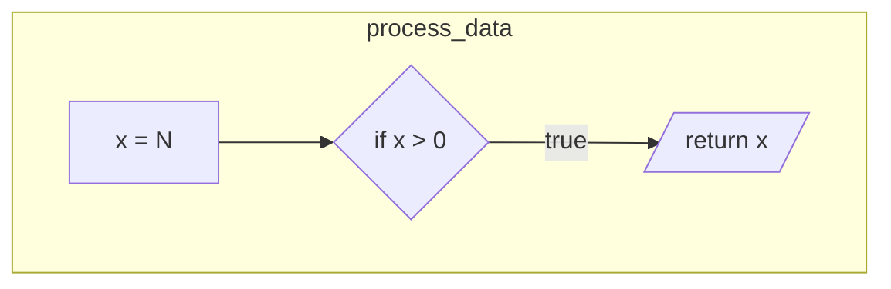

# code2flow

**Python Code Flow Analysis Tool** - Static analysis for control flow graphs (CFG), data flow graphs (DFG), and call graph extraction.

## Performance Optimization

For large projects (>1000 functions), use **Fast Mode**:

```bash
# Ultra-fast analysis (5-10x faster)
code2flow /path/to/project --fast

# Custom performance settings
code2flow /path/to/project \
    --parallel-workers 8 \
    --max-depth 3 \
    --skip-data-flow \
    --cache-dir ./.cache
```

### Performance Tips

| Technique | Speedup | Use Case |
|-----------|---------|----------|
| `--fast` mode | 5-10x | Initial exploration |
| Parallel workers | 2-4x | Multi-core machines |
| Caching | 3-5x | Repeated analysis |
| Depth limiting | 2-3x | Large codebases |
| Skip private methods | 1.5-2x | Public API analysis |

### Benchmarks

| Project Size | Functions | Time (fast) | Time (full) |
|--------------|-----------|-------------|-------------|
| Small (<100) | ~50 | 0.5s | 2s |
| Medium (1K) | ~500 | 3s | 15s |
| Large (10K) | ~2000 | 15s | 120s |

## Features

- **Control Flow Graph (CFG)**: Extract execution paths from Python AST
- **Data Flow Graph (DFG)**: Track variable definitions and dependencies  
- **Call Graph Analysis**: Map function calls and dependencies
- **Pattern Detection**: Identify design patterns (state machines, factories, recursion)
- **Compact Output**: Deduplicated flow diagrams with pattern recognition
- **Multiple Output Formats**: YAML, JSON, Mermaid diagrams, PNG visualizations
- **LLM-Ready Output**: Generate prompts for reverse engineering

## Installation

```bash
# Install from source
pip install -e .

# Or with development dependencies
pip install -e ".[dev]"
```

## Quick Start

```bash
# Analyze a Python project
code2flow /path/to/project

# With verbose output
code2flow /path/to/project -v

# Specify output directory and formats
code2flow /path/to/project -o ./analysis --format yaml,json,mermaid,png

# Use different analysis modes
code2flow /path/to/project -m static    # Fast static analysis only
code2flow /path/to/project -m hybrid     # Combined analysis (default)
```

## Usage

### Basic Analysis
```bash
code2flow /path/to/project
```

### Analysis Modes
```bash
# Static analysis only (fastest)
code2flow /path/to/project -m static

# Dynamic analysis with tracing
code2flow /path/to/project -m dynamic

# Hybrid analysis (recommended)
code2flow /path/to/project -m hybrid

# Behavioral pattern focus
code2flow /path/to/project -m behavioral

# Reverse engineering ready
code2flow /path/to/project -m reverse
```

### Custom Output
```bash
code2flow /path/to/project -o my_analysis
```

## Output Files

| File | Description |
|------|-------------|
| `analysis.yaml` | Complete structured analysis data |
| `analysis.json` | JSON format for programmatic use |
| `flow.mmd` | Full Mermaid flowchart (all nodes) |
| `compact_flow.mmd` | **Compact flowchart** - deduplicated nodes, grouped by function |
| `calls.mmd` | Function call graph |
| `cfg.png` | Control flow visualization |
| `call_graph.png` | Call graph visualization |
| `llm_prompt.md` | LLM-ready analysis summary |

### Compact Flow Format

The `compact_flow.mmd` file provides optimized output:

- **Deduplication**: Identical node patterns are merged (e.g., `x = 1`, `x = 2` → `x = N`)
- **Function Subgraphs**: Nodes grouped by function in subgraphs
- **Pattern Preservation**: Control flow structure maintained while reducing file size
- **Import Reuse**: Common patterns linked rather than duplicated

Example compact output:


## Understanding the Output

### LLM Prompt Structure
The generated prompt includes:
- System overview with metrics
- Call graph structure
- Behavioral patterns with confidence scores
- Data flow insights
- State machine definitions
- Reverse engineering guidelines

### Behavioral Patterns
Each pattern includes:
- **Name**: Descriptive identifier
- **Type**: sequential, conditional, iterative, recursive, state_machine
- **Entry/Exit points**: Key functions
- **Decision points**: Conditional logic locations
- **Data transformations**: Variable dependencies
- **Confidence**: Pattern detection certainty

### Reverse Engineering Guidelines
The analysis provides specific guidance for:
1. Preserving call graph structure
2. Implementing identified patterns
3. Maintaining data dependencies
4. Recreating state machines
5. Preserving decision logic

## Advanced Features

### State Machine Detection
Automatically identifies:
- State variables
- Transition methods
- Source and destination states
- State machine hierarchy

### Data Flow Tracking
Maps:
- Variable dependencies
- Data transformations
- Information flow paths
- Side effects

### Dynamic Tracing
When using dynamic mode:
- Function entry/exit timing
- Call stack reconstruction
- Exception tracking
- Performance profiling

## Integration with LLMs

The generated `system_analysis_prompt.md` is designed to be:
- **Comprehensive**: Contains all necessary system information
- **Structured**: Organized for easy parsing
- **Actionable**: Includes specific implementation guidance
- **Language-agnostic**: Describes behavior, not implementation

Example usage with an LLM:
```
"Based on the system analysis provided, implement this system in Go,
preserving all behavioral patterns and data flow characteristics."
```

## Limitations

- Dynamic analysis requires test files
- Complex inheritance hierarchies may need manual review
- External library calls are treated as black boxes
- Runtime reflection and metaprogramming not fully captured

## Contributing

The analyzer is designed to be extensible. Key areas for enhancement:
- Additional pattern types
- Language-specific optimizations
- Improved visualization
- Real-time analysis mode

## License

Apache License 2.0 - see [LICENSE](LICENSE) for details.

## Author

Created by **Tom Sapletta** - [tom@sapletta.com](mailto:tom@sapletta.com)
