# System Architecture Analysis

## Overview

- **Project**: /home/tom/github/wronai/nlp2cmd/src/nlp2cmd
- **Analysis Mode**: static
- **Total Functions**: 3567
- **Total Classes**: 398
- **Modules**: 197
- **Entry Points**: 3330

## Architecture by Module

### generation.template_generator
- **Functions**: 128
- **Classes**: 2
- **File**: `template_generator.py`

### schemas
- **Functions**: 84
- **Classes**: 2
- **File**: `__init__.py`

### web_schema.form_data_loader
- **Functions**: 76
- **Classes**: 1
- **File**: `form_data_loader.py`

### web_schema.site_explorer
- **Functions**: 64
- **Classes**: 3
- **File**: `site_explorer.py`

### core.toon_integration
- **Functions**: 60
- **Classes**: 1
- **File**: `toon_integration.py`

### thermodynamic
- **Functions**: 60
- **Classes**: 11
- **File**: `__init__.py`

### automation.action_planner
- **Functions**: 50
- **Classes**: 3
- **File**: `action_planner.py`

### generation.semantic_matcher_optimized
- **Functions**: 49
- **Classes**: 3
- **File**: `semantic_matcher_optimized.py`

### automation.password_store
- **Functions**: 47
- **Classes**: 7
- **File**: `password_store.py`

### adapters.kubernetes
- **Functions**: 46
- **Classes**: 3
- **File**: `kubernetes.py`

### core.core_transform
- **Functions**: 45
- **Classes**: 1
- **File**: `core_transform.py`

### adapters.browser
- **Functions**: 45
- **Classes**: 2
- **File**: `browser.py`

### generation.fuzzy_schema_matcher
- **Functions**: 43
- **Classes**: 4
- **File**: `fuzzy_schema_matcher.py`

### generation.evolutionary_cache
- **Functions**: 43
- **Classes**: 3
- **File**: `evolutionary_cache.py`

### web_schema.browser_config
- **Functions**: 43
- **Classes**: 2
- **File**: `browser_config.py`

### parsing.toon_parser
- **Functions**: 43
- **Classes**: 3
- **File**: `toon_parser.py`

### validators
- **Functions**: 42
- **Classes**: 8
- **File**: `__init__.py`

### adapters.dynamic
- **Functions**: 42
- **Classes**: 2
- **File**: `dynamic.py`

### registry
- **Functions**: 41
- **Classes**: 6
- **File**: `__init__.py`

### generation.thermodynamic_components
- **Functions**: 40
- **Classes**: 5
- **File**: `thermodynamic_components.py`

## Key Entry Points

Main execution flows into the system:

### pipeline_runner_plans.PlanExecutionMixin._execute_plan_step
> Execute a single ActionPlan step. Returns extracted value or None.
- **Calls**: self._resolve_plan_variables, Console, pipeline_runner_utils._MarkdownConsoleWrapper.print, params.get, page.goto, page.wait_for_timeout, ValueError, url.startswith

### pipeline_runner_plans._execute_plan_step
> Execute a single ActionPlan step. Returns extracted value or None.
- **Calls**: self._resolve_plan_variables, Console, pipeline_runner_utils._MarkdownConsoleWrapper.print, params.get, page.goto, page.wait_for_timeout, ValueError, url.startswith

### pipeline_runner_browser.BrowserExecutionMixin._run_dom_multi_action
> Execute multiple browser actions in sequence.
- **Calls**: payload.get, Console, _MarkdownConsoleWrapper, payload.get, RunnerResult, RunnerResult, sync_playwright, p.chromium.launch

### pipeline_runner_browser._run_dom_multi_action
> Execute multiple browser actions in sequence.
- **Calls**: payload.get, Console, _MarkdownConsoleWrapper, payload.get, RunnerResult, RunnerResult, sync_playwright, p.chromium.launch

### pipeline_runner_plans.PlanExecutionMixin.execute_action_plan
> Execute an ActionPlan step by step using Playwright.

Args:
    plan: ActionPlan instance with steps to execute
    dry_run: If True, only show the pl
- **Calls**: Console, frozenset, console.print, console.print, enumerate, None.strip, RunnerResult, any

### pipeline_runner_plans.execute_action_plan
> Execute an ActionPlan step by step using Playwright.

Args:
    plan: ActionPlan instance with steps to execute
    dry_run: If True, only show the pl
- **Calls**: Console, frozenset, console.print, console.print, enumerate, None.strip, RunnerResult, any

### adapters.canvas.CanvasAdapter.execute_drawing_plan
> Execute a canvas drawing plan on a Playwright page.

IMPROVED: Added detailed diagnostic logging for each step.
- **Calls**: plan.get, MouseController, enumerate, json.loads, step.get, step.get, pipeline_runner_utils._MarkdownConsoleWrapper.print, pipeline_runner_utils._MarkdownConsoleWrapper.print

### adapters.canvas.execute_drawing_plan
> Execute a canvas drawing plan on a Playwright page.

IMPROVED: Added detailed diagnostic logging for each step.
- **Calls**: plan.get, MouseController, enumerate, json.loads, step.get, step.get, pipeline_runner_utils._MarkdownConsoleWrapper.print, pipeline_runner_utils._MarkdownConsoleWrapper.print

### execution.runner.ExecutionRunner.run_command
> Execute a shell command with real-time output.

Args:
    command: Shell command to execute
    cwd: Working directory
    env: Environment variables

- **Calls**: time.time, self.print_markdown_block, ExecutionResult, self.execution_history.append, subprocess.Popen, None.join, None.join, subprocess.run

### registry.ActionRegistry._register_builtin_actions
> Register built-in actions.
- **Calls**: self.register, self.register, self.register, self.register, self.register, self.register, self.register, self.register

### registry._register_builtin_actions
> Register built-in actions.
- **Calls**: self.register, self.register, self.register, self.register, self.register, self.register, self.register, self.register

### pipeline_runner_desktop.DesktopExecutionMixin._execute_desktop_plan_step
> Execute an ActionPlan step via local desktop automation.

Supports three backends:
- ydotool: works on Wayland (requires ydotoold daemon)
- xdotool: w
- **Calls**: self._resolve_plan_variables, str, self._detect_desktop_backend, ValueError, ValueError, str, str, int

### pipeline_runner_desktop._execute_desktop_plan_step
> Execute an ActionPlan step via local desktop automation.

Supports three backends:
- ydotool: works on Wayland (requires ydotoold daemon)
- xdotool: w
- **Calls**: self._resolve_plan_variables, str, self._detect_desktop_backend, ValueError, ValueError, str, str, int

### automation.action_planner.ActionPlanner._generate_rule_based_canvas_plan
> Generate a drawing plan for an arbitrary object using rules.

This is a fallback when LLM is not available. Uses object name to determine
shape compos
- **Calls**: re.search, None.strip, object_name.lower, any, ActionPlan, None.strip, ActionStep, ActionStep

### automation.action_planner._generate_rule_based_canvas_plan
> Generate a drawing plan for an arbitrary object using rules.

This is a fallback when LLM is not available. Uses object name to determine
shape compos
- **Calls**: re.search, None.strip, object_name.lower, any, ActionPlan, None.strip, ActionStep, ActionStep

### web_schema.form_handler.FormHandler.detect_form_fields
> Detect all form fields on a page.

Args:
    page: Playwright page object

Returns:
    List of FormField objects
- **Calls**: page.query_selector_all, self._print_yaml, page.query_selector_all, self._print_yaml, page.query_selector_all, self._print_yaml, page.query_selector_all, self._print_yaml

### web_schema.site_explorer.SiteExplorer.find_form
> Find a form on the website matching the intent.

Args:
    url: Starting URL (homepage)
    intent: Type of form to find (contact, search, newsletter,
- **Calls**: time.perf_counter, executor.ExecutionContext.set, self._find_best_form_candidate, ExplorationResult, None.start, p.chromium.launch, browser.new_context, context.new_page

### web_schema.site_explorer.find_form
> Find a form on the website matching the intent.

Args:
    url: Starting URL (homepage)
    intent: Type of form to find (contact, search, newsletter,
- **Calls**: time.perf_counter, executor.ExecutionContext.set, self._find_best_form_candidate, ExplorationResult, None.start, p.chromium.launch, browser.new_context, context.new_page

### web_schema.site_explorer.SiteExplorer._analyze_page
> Analyze a page for forms, iframes, and links.
- **Calls**: PageInfo, self._score_page, executor.ExecutionContext.set, page.query_selector_all, page.query_selector_all, page.query_selector_all, self._normalize_url, page.title

### web_schema.site_explorer._analyze_page
> Analyze a page for forms, iframes, and links.
- **Calls**: PageInfo, self._score_page, executor.ExecutionContext.set, page.query_selector_all, page.query_selector_all, page.query_selector_all, self._normalize_url, page.title

### adapters.desktop.DesktopAdapter._build_actions
> Build action sequence based on intent.
- **Calls**: entities.get, self.APP_COMMANDS.get, pipeline_runner_utils._debug, actions.append, self._detect_followup_actions, actions.extend, self._extract_app_name, app_name.lower

### adapters.desktop._build_actions
> Build action sequence based on intent.
- **Calls**: entities.get, self.APP_COMMANDS.get, pipeline_runner_utils._debug, actions.append, self._detect_followup_actions, actions.extend, self._extract_app_name, app_name.lower

### generation.keywords.keyword_detector.KeywordIntentDetector._fast_path_detection
> Fast path detection for common patterns.
- **Calls**: None.join, text_lower.strip, _SQL_EXACT.items, any, _SHELL_TERMS.items, re.search, re.search, re.search

### generation.keywords.keyword_detector._fast_path_detection
> Fast path detection for common patterns.
- **Calls**: None.join, text_lower.strip, _SQL_EXACT.items, any, _SHELL_TERMS.items, re.search, re.search, re.search

### adapters.browser.BrowserAdapter.generate
- **Calls**: str, pipeline_runner_utils._debug, isinstance, pipeline_runner_utils._debug, self._has_fill_form_action, self._should_explore_for_forms, self._should_explore_for_content, self._has_type_action

### adapters.browser.generate
- **Calls**: str, pipeline_runner_utils._debug, isinstance, pipeline_runner_utils._debug, self._has_fill_form_action, self._should_explore_for_forms, self._should_explore_for_content, self._has_type_action

### web_schema.site_explorer.SiteExplorer.find_content
> Find content on the website (articles, products, docs, etc.).

Args:
    url: Starting URL (homepage)
    content_type: Type of content to find (artic
- **Calls**: time.perf_counter, self._resolve_platform_url, self._try_github_api, executor.ExecutionContext.set, self._explore_recursive, pipeline_runner_utils._debug, self._find_best_content_candidate, ExplorationResult

### web_schema.site_explorer.find_content
> Find content on the website (articles, products, docs, etc.).

Args:
    url: Starting URL (homepage)
    content_type: Type of content to find (artic
- **Calls**: time.perf_counter, self._resolve_platform_url, self._try_github_api, executor.ExecutionContext.set, self._explore_recursive, pipeline_runner_utils._debug, self._find_best_content_candidate, ExplorationResult

### generation.evolutionary_cache.EvolutionaryCache.lookup
> 4-tier lookup: cache → template → regex → LLM teacher.
Returns LookupResult with command and timing.
- **Calls**: time.perf_counter, generation.evolutionary_cache.fingerprint, generation.evolutionary_cache.fuzzy_fingerprint, LookupResult, self.stats.get, None.lower, None.isoformat, self.save

### generation.evolutionary_cache.lookup
> 4-tier lookup: cache → template → regex → LLM teacher.
Returns LookupResult with command and timing.
- **Calls**: time.perf_counter, generation.evolutionary_cache.fingerprint, generation.evolutionary_cache.fuzzy_fingerprint, LookupResult, self.stats.get, None.lower, None.isoformat, self.save

## Process Flows

Key execution flows identified:

### Flow 1: _execute_plan_step
```
_execute_plan_step [pipeline_runner_plans.PlanExecutionMixin
  └─ →> print
```

### Flow 2: _execute_plan_step
```
_execute_plan_step [pipeline_runner_plans
  └─ →> print
```

### Flow 3: _run_dom_multi_action
```
_run_dom_multi_action [pipeline_runner_browser.BrowserExecutionMixin
```

### Flow 4: _run_dom_multi_action
```
_run_dom_multi_action [pipeline_runner_browser
```

### Flow 5: execute_action_plan
```
execute_action_plan [pipeline_runner_plans.PlanExecutionMixin
```

### Flow 6: execute_action_plan
```
execute_action_plan [pipeline_runner_plans
```

### Flow 7: execute_drawing_plan
```
execute_drawing_plan [adapters.canvas.CanvasAdapter
```

### Flow 8: execute_drawing_plan
```
execute_drawing_plan [adapters.canvas
```

### Flow 9: run_command
```
run_command [execution.runner.ExecutionRunner
```

### Flow 10: _register_builtin_actions
```
_register_builtin_actions [registry.ActionRegistry
```

## Key Classes

### generation.template_generator.TemplateGenerator
> Generate DSL commands from templates.

Uses predefined templates filled with extracted entities.
Fal
- **Methods**: 100
- **Key Methods**: generation.template_generator.TemplateGenerator.__init__, generation.template_generator.TemplateGenerator._load_defaults_from_json, generation.template_generator.TemplateGenerator._load_templates_from_json, generation.template_generator.TemplateGenerator._get_default, generation.template_generator.TemplateGenerator.generate, generation.template_generator.TemplateGenerator._find_alternative_template, generation.template_generator.TemplateGenerator._get_intent_aliases, generation.template_generator.TemplateGenerator._prepare_entities, generation.template_generator.TemplateGenerator._prepare_sql_entities, generation.template_generator.TemplateGenerator._prepare_shell_entities

### web_schema.form_data_loader.FormDataLoader
> Loads form field data from multiple sources:
1. .env file (for sensitive data like email, name, phon
- **Methods**: 45
- **Key Methods**: web_schema.form_data_loader.FormDataLoader.__init__, web_schema.form_data_loader.FormDataLoader._dedupe_preserve_order, web_schema.form_data_loader.FormDataLoader.dedupe_selectors, web_schema.form_data_loader.FormDataLoader._parse_domain, web_schema.form_data_loader.FormDataLoader._safe_domain_filename, web_schema.form_data_loader.FormDataLoader._user_sites_dir, web_schema.form_data_loader.FormDataLoader._project_sites_dir, web_schema.form_data_loader.FormDataLoader._site_profile_paths, web_schema.form_data_loader.FormDataLoader.get_site_profile_write_path, web_schema.form_data_loader.FormDataLoader._load_site_profile_payload

### schemas.SchemaRegistry
> Registry for file format schemas with validation and repair capabilities.
- **Methods**: 37
- **Key Methods**: schemas.SchemaRegistry.__init__, schemas.SchemaRegistry._register_builtin_schemas, schemas.SchemaRegistry.register, schemas.SchemaRegistry.get, schemas.SchemaRegistry.has_schema, schemas.SchemaRegistry.list_schemas, schemas.SchemaRegistry.unregister, schemas.SchemaRegistry.find_schema_for_file, schemas.SchemaRegistry.find_schema_by_mime_type, schemas.SchemaRegistry.find_extension_conflicts

### core.toon_integration.ToonDataManager
> Unified data manager using TOON format
- **Methods**: 27
- **Key Methods**: core.toon_integration.ToonDataManager.__init__, core.toon_integration.ToonDataManager._ensure_loaded, core.toon_integration.ToonDataManager.get_all_commands, core.toon_integration.ToonDataManager.get_shell_commands, core.toon_integration.ToonDataManager.get_browser_commands, core.toon_integration.ToonDataManager.get_command_by_name, core.toon_integration.ToonDataManager.search_commands, core.toon_integration.ToonDataManager.get_config, core.toon_integration.ToonDataManager.get_llm_config, core.toon_integration.ToonDataManager.get_test_commands

### web_schema.site_explorer.SiteExplorer
> Explores website to find forms, contact pages, and other content.

Usage:
    explorer = SiteExplore
- **Methods**: 27
- **Key Methods**: web_schema.site_explorer.SiteExplorer.__init__, web_schema.site_explorer.SiteExplorer._setup_resource_blocking, web_schema.site_explorer.SiteExplorer._resolve_platform_url, web_schema.site_explorer.SiteExplorer._goto_with_retry, web_schema.site_explorer.SiteExplorer._try_github_api, web_schema.site_explorer.SiteExplorer._detect_docs_framework, web_schema.site_explorer.SiteExplorer._record_timing, web_schema.site_explorer.SiteExplorer.get_timing_stats, web_schema.site_explorer.SiteExplorer._fallback_static_scrape, web_schema.site_explorer.SiteExplorer.find_content

### core.core_transform.NLP2CMD
> Main class for Natural Language to Command transformation.

This class orchestrates the transformati
- **Methods**: 23
- **Key Methods**: core.core_transform.NLP2CMD.__init__, core.core_transform.NLP2CMD.transform, core.core_transform.NLP2CMD.transform_ir, core.core_transform.NLP2CMD._normalize_entities, core.core_transform.NLP2CMD._normalize_entities_sql, core.core_transform.NLP2CMD._normalize_entities_shell, core.core_transform.NLP2CMD._normalize_entities_docker, core.core_transform.NLP2CMD._normalize_entities_kubernetes, core.core_transform.NLP2CMD._normalize_entities_dql, core.core_transform.NLP2CMD._normalize_shell_entities

### adapters.browser.BrowserAdapter
> Minimal adapter that turns NL into dom_dql.v1 navigation (Playwright).
- **Methods**: 22
- **Key Methods**: adapters.browser.BrowserAdapter.__init__, adapters.browser.BrowserAdapter._extract_url, adapters.browser.BrowserAdapter._extract_type_text, adapters.browser.BrowserAdapter._has_type_action, adapters.browser.BrowserAdapter._should_explore_for_content, adapters.browser.BrowserAdapter._should_explore_for_forms, adapters.browser.BrowserAdapter._has_fill_form_action, adapters.browser.BrowserAdapter._has_press_enter, adapters.browser.BrowserAdapter._has_form_action, adapters.browser.BrowserAdapter._has_submit_action
- **Inherits**: BaseDSLAdapter

### adapters.kubernetes.KubernetesAdapter
> Kubernetes adapter for kubectl commands and manifests.

Transforms natural language into kubectl com
- **Methods**: 22
- **Key Methods**: adapters.kubernetes.KubernetesAdapter.__init__, adapters.kubernetes.KubernetesAdapter._parse_cluster_context, adapters.kubernetes.KubernetesAdapter._normalize_resource, adapters.kubernetes.KubernetesAdapter.generate, adapters.kubernetes.KubernetesAdapter._generate_get, adapters.kubernetes.KubernetesAdapter._generate_describe, adapters.kubernetes.KubernetesAdapter._generate_apply, adapters.kubernetes.KubernetesAdapter._generate_delete, adapters.kubernetes.KubernetesAdapter._generate_scale, adapters.kubernetes.KubernetesAdapter._generate_logs
- **Inherits**: BaseDSLAdapter

### automation.action_planner.ActionPlanner
> Decomposes complex NL commands into ActionPlan via rules or LLM.

Costs:
- Rule match (known service
- **Methods**: 21
- **Key Methods**: automation.action_planner.ActionPlanner.__init__, automation.action_planner.ActionPlanner.decompose, automation.action_planner.ActionPlanner.decompose_sync, automation.action_planner.ActionPlanner._try_rule_decomposition, automation.action_planner.ActionPlanner._resolve_service, automation.action_planner.ActionPlanner._wants_new_tab, automation.action_planner.ActionPlanner._wants_existing_firefox, automation.action_planner.ActionPlanner._wants_create_key, automation.action_planner.ActionPlanner._build_navigation_steps, automation.action_planner.ActionPlanner._build_session_check_steps

### generation.semantic_matcher_optimized.OptimizedSemanticMatcher
> Optimized semantic similarity matcher using sentence embeddings.

Features:
- Handles typos and para
- **Methods**: 20
- **Key Methods**: generation.semantic_matcher_optimized.OptimizedSemanticMatcher.__init__, generation.semantic_matcher_optimized.OptimizedSemanticMatcher._preload_models, generation.semantic_matcher_optimized.OptimizedSemanticMatcher._get_model, generation.semantic_matcher_optimized.OptimizedSemanticMatcher._get_polish_model, generation.semantic_matcher_optimized.OptimizedSemanticMatcher._load_model, generation.semantic_matcher_optimized.OptimizedSemanticMatcher.add_intent, generation.semantic_matcher_optimized.OptimizedSemanticMatcher.add_intents_batch, generation.semantic_matcher_optimized.OptimizedSemanticMatcher._encode_text, generation.semantic_matcher_optimized.OptimizedSemanticMatcher._encode_batch, generation.semantic_matcher_optimized.OptimizedSemanticMatcher._encode_with_cache

### generation.evolutionary_cache.EvolutionaryCache
> Manages the .nlp2cmd/ learned schema cache.

Usage:
    cache = EvolutionaryCache()
    result = cac
- **Methods**: 20
- **Key Methods**: generation.evolutionary_cache.EvolutionaryCache.__init__, generation.evolutionary_cache.EvolutionaryCache._ensure_dir, generation.evolutionary_cache.EvolutionaryCache._load, generation.evolutionary_cache.EvolutionaryCache.save, generation.evolutionary_cache.EvolutionaryCache.lookup, generation.evolutionary_cache.EvolutionaryCache._ask_teacher, generation.evolutionary_cache.EvolutionaryCache._clean, generation.evolutionary_cache.EvolutionaryCache._try_template_pipeline, generation.evolutionary_cache.EvolutionaryCache._try_english_pipeline, generation.evolutionary_cache.EvolutionaryCache._try_polish_template

### parsing.toon_parser.ToonParser
> Unified TOON format parser with hierarchical access
- **Methods**: 20
- **Key Methods**: parsing.toon_parser.ToonParser.__init__, parsing.toon_parser.ToonParser.parse_file, parsing.toon_parser.ToonParser.parse_content, parsing.toon_parser.ToonParser._parse_lines, parsing.toon_parser.ToonParser._parse_array_node, parsing.toon_parser.ToonParser._parse_object_node, parsing.toon_parser.ToonParser._parse_key_value, parsing.toon_parser.ToonParser._parse_value, parsing.toon_parser.ToonParser._extract_categories, parsing.toon_parser.ToonParser.get_category

### automation.step_validator.StepValidator
> Validates pre/post conditions for ActionPlan steps.

Checks clipboard state, DOM elements, environme
- **Methods**: 19
- **Key Methods**: automation.step_validator.StepValidator.__init__, automation.step_validator.StepValidator.metrics, automation.step_validator.StepValidator.start_step, automation.step_validator.StepValidator.finish_step, automation.step_validator.StepValidator.get_clipboard, automation.step_validator.StepValidator.set_clipboard, automation.step_validator.StepValidator.snapshot_clipboard, automation.step_validator.StepValidator.clipboard_changed, automation.step_validator.StepValidator.validate_pre_navigate, automation.step_validator.StepValidator.validate_pre_check_session

### automation.mouse_controller.MouseController
> Advanced mouse control via Playwright with human-like movements.

Supports:
- Click, double-click, r
- **Methods**: 19
- **Key Methods**: automation.mouse_controller.MouseController.__init__, automation.mouse_controller.MouseController._jitter, automation.mouse_controller.MouseController._human_delay, automation.mouse_controller.MouseController.click, automation.mouse_controller.MouseController.double_click, automation.mouse_controller.MouseController.right_click, automation.mouse_controller.MouseController.move_to, automation.mouse_controller.MouseController.drag, automation.mouse_controller.MouseController._compute_bezier, automation.mouse_controller.MouseController.bezier_move

### generation.fuzzy_schema_matcher.FuzzySchemaMatcher
> Language-agnostic fuzzy matcher using JSON schemas.

Works with any language by using character-leve
- **Methods**: 19
- **Key Methods**: generation.fuzzy_schema_matcher.FuzzySchemaMatcher.__init__, generation.fuzzy_schema_matcher.FuzzySchemaMatcher.load_schema, generation.fuzzy_schema_matcher.FuzzySchemaMatcher.add_phrase, generation.fuzzy_schema_matcher.FuzzySchemaMatcher.add_phrases_from_dict, generation.fuzzy_schema_matcher.FuzzySchemaMatcher._build_index, generation.fuzzy_schema_matcher.FuzzySchemaMatcher._index_phrase, generation.fuzzy_schema_matcher.FuzzySchemaMatcher._normalize, generation.fuzzy_schema_matcher.FuzzySchemaMatcher._remove_spaces, generation.fuzzy_schema_matcher.FuzzySchemaMatcher._get_ngrams, generation.fuzzy_schema_matcher.FuzzySchemaMatcher._ngram_similarity

### adapters.dynamic.DynamicAdapter
> Dynamic adapter that uses extracted schemas instead of hardcoded patterns.

This adapter can work wi
- **Methods**: 19
- **Key Methods**: adapters.dynamic.DynamicAdapter.__init__, adapters.dynamic.DynamicAdapter.check_safety, adapters.dynamic.DynamicAdapter._load_common_commands, adapters.dynamic.DynamicAdapter.register_schema_source, adapters.dynamic.DynamicAdapter.generate, adapters.dynamic.DynamicAdapter._find_matching_commands, adapters.dynamic.DynamicAdapter._generate_from_schema, adapters.dynamic.DynamicAdapter._generate_make_command, adapters.dynamic.DynamicAdapter._generate_web_dql, adapters.dynamic.DynamicAdapter._generate_from_template
- **Inherits**: BaseDSLAdapter

### adapters.desktop.DesktopAdapter
> Adapter for desktop GUI automation via VNC/noVNC + xdotool/wmctrl.
- **Methods**: 19
- **Key Methods**: adapters.desktop.DesktopAdapter.__init__, adapters.desktop.DesktopAdapter.generate, adapters.desktop.DesktopAdapter._build_actions, adapters.desktop.DesktopAdapter._build_email_actions, adapters.desktop.DesktopAdapter._build_email_compose, adapters.desktop.DesktopAdapter._detect_followup_actions, adapters.desktop.DesktopAdapter.detect_intent, adapters.desktop.DesktopAdapter._extract_app_name, adapters.desktop.DesktopAdapter._extract_quoted_text, adapters.desktop.DesktopAdapter._extract_shortcut
- **Inherits**: BaseAdapter

### generation.pipeline.RuleBasedPipeline
> Complete rule-based NL → DSL pipeline.

Combines intent detection, entity extraction, and template g
- **Methods**: 18
- **Key Methods**: generation.pipeline.RuleBasedPipeline.__init__, generation.pipeline.RuleBasedPipeline.complex_detector, generation.pipeline.RuleBasedPipeline.action_planner, generation.pipeline.RuleBasedPipeline.evolutionary_cache, generation.pipeline.RuleBasedPipeline.enhanced_detector, generation.pipeline.RuleBasedPipeline.process, generation.pipeline.RuleBasedPipeline.process_steps, generation.pipeline.RuleBasedPipeline._process_with_detection, generation.pipeline.RuleBasedPipeline._split_sentences, generation.pipeline.RuleBasedPipeline._persist_result

### web_schema.browser_config.BrowserConfigLoader
> Single source of truth for browser automation config.

Loads from ``data/browser_config/*.yaml`` wit
- **Methods**: 18
- **Key Methods**: web_schema.browser_config.BrowserConfigLoader.__init__, web_schema.browser_config.BrowserConfigLoader._ensure_loaded, web_schema.browser_config.BrowserConfigLoader.get_dismiss_selectors, web_schema.browser_config.BrowserConfigLoader.get_submit_selectors, web_schema.browser_config.BrowserConfigLoader.get_type_selectors, web_schema.browser_config.BrowserConfigLoader.get_contact_page_link_selectors, web_schema.browser_config.BrowserConfigLoader.get_common_contact_paths, web_schema.browser_config.BrowserConfigLoader.get_contact_url_keywords, web_schema.browser_config.BrowserConfigLoader.get_contact_page_keywords, web_schema.browser_config.BrowserConfigLoader.get_junk_field_types

### adapters.docker.DockerAdapter
> Docker adapter for CLI and Compose operations.

Transforms natural language into Docker commands
wit
- **Methods**: 18
- **Key Methods**: adapters.docker.DockerAdapter.__init__, adapters.docker.DockerAdapter._parse_compose_context, adapters.docker.DockerAdapter.generate, adapters.docker.DockerAdapter._generate_run, adapters.docker.DockerAdapter._generate_stop, adapters.docker.DockerAdapter._generate_remove, adapters.docker.DockerAdapter._generate_build, adapters.docker.DockerAdapter._generate_pull, adapters.docker.DockerAdapter._generate_compose_up, adapters.docker.DockerAdapter._generate_compose_down
- **Inherits**: BaseDSLAdapter

## Data Transformation Functions

Key functions that process and transform data:

### pipeline_runner_shell.ShellExecutionMixin._parse_shell_command
- **Output to**: command.strip, cmd.lower, any, any, re.search

### pipeline_runner_shell._parse_shell_command
- **Output to**: command.strip, cmd.lower, any, any, re.search

### monitoring.resources.ResourceMonitor._process_cpu_time_seconds
> Return process CPU time in seconds (user+system).
- **Output to**: self.process.cpu_times, float, float, getattr, getattr

### monitoring.resources.ResourceMonitor.format_metrics
> Format metrics for display.
- **Output to**: None.join, lines.append

### monitoring.resources.format_last_metrics
> Format metrics from last execution for display.
- **Output to**: monitoring.resources.ResourceMonitor.get_last_metrics, _monitor.format_metrics

### monitoring.resources._process_cpu_time_seconds
> Return process CPU time in seconds (user+system).
- **Output to**: self.process.cpu_times, float, float, getattr, getattr

### monitoring.resources.format_metrics
> Format metrics for display.
- **Output to**: None.join, lines.append

### monitoring.resources._PsutilStub.Process
- **Output to**: _ProcessStub, _MemInfo, _CpuTimes

### monitoring.resources.Process
- **Output to**: _ProcessStub, _MemInfo, _CpuTimes

### monitoring.token_costs.TokenCostEstimator.format_estimate
> Format token cost estimate for display.
- **Output to**: None.join, lines.append

### monitoring.token_costs.format_token_estimate
> Format token cost estimate for display.
- **Output to**: _estimator.format_estimate

### monitoring.token_costs.parse_metrics_string
> Parse metrics string like '⏱️ Time: 2.6ms | 💻 CPU: 0.0% | 🧠 RAM: 53.5MB (0.1%) | ⚡ Energy: 0.022mJ'
- **Output to**: None.strip, None.strip, None.strip, None.strip, float

### monitoring.token_costs.format_estimate
> Format token cost estimate for display.
- **Output to**: None.join, lines.append

### schema_driven.SchemaDrivenNLP2CMD.transform
- **Output to**: self._select_action, self._extract_params, self._render_dsl, str, ActionIR

### schema_driven.transform
- **Output to**: self._select_action, self._extract_params, self._render_dsl, str, ActionIR

### automation.schema_fallback.SchemaFallback._parse_llm_steps
> Parse LLM response into step dictionaries.
- **Output to**: isinstance, json.loads, isinstance, s.get, s.get

### automation.schema_fallback._parse_llm_steps
> Parse LLM response into step dictionaries.
- **Output to**: isinstance, json.loads, isinstance, s.get, s.get

### automation.step_validator.StepValidator.validate_pre_navigate
> Validate before navigation step.
- **Output to**: params.get, ValidationResult, ValidationResult, url.startswith, ValidationResult

### automation.step_validator.StepValidator.validate_pre_check_session
> Validate before session check — page must be loaded.
- **Output to**: ValidationResult, ValidationResult, ValidationResult

### automation.step_validator.StepValidator.validate_pre_extract_key
> Validate before key extraction — must be on correct page.
- **Output to**: self.snapshot_clipboard, ValidationResult, ValidationResult, params.get, ValidationResult

### automation.step_validator.StepValidator.validate_pre_prompt_secret
> Validate before prompting for secret — check if already available.
- **Output to**: params.get, None.strip, os.environ.get, variables.items, ValidationResult

### automation.step_validator.StepValidator.validate_post_navigate
> Validate after navigation — page loaded?
- **Output to**: ValidationResult, params.get, page.title, ValidationResult, ValidationResult

### automation.step_validator.StepValidator.validate_post_check_session
> Validate after session check — is user logged in?
- **Output to**: ValidationResult, ValidationResult, params.get, ValidationResult

### automation.step_validator.StepValidator.validate_post_extract_key
> Validate after key extraction — did we get a valid key?
- **Output to**: params.get, self.clipboard_changed, ValidationResult, ValidationResult, re.match

### automation.step_validator.StepValidator.validate_post_save_env
> Validate after saving to .env — does file contain the variable?
- **Output to**: params.get, params.get, ValidationResult, ValidationResult, open

## Public API Surface

Functions exposed as public API (no underscore prefix):

- `pipeline_runner_plans.PlanExecutionMixin.execute_action_plan` - 261 calls
- `pipeline_runner_plans.execute_action_plan` - 261 calls
- `cli.commands.run.handle_run_mode` - 261 calls
- `adapters.canvas.CanvasAdapter.execute_drawing_plan` - 193 calls
- `adapters.canvas.execute_drawing_plan` - 193 calls
- `cli.main.main` - 115 calls
- `execution.runner.ExecutionRunner.run_command` - 109 calls
- `execution.runner.run_command` - 109 calls
- `generation.train_model.train_all_models` - 86 calls
- `web_schema.form_handler.FormHandler.detect_form_fields` - 83 calls
- `web_schema.form_handler.detect_form_fields` - 83 calls
- `web_schema.site_explorer.SiteExplorer.find_form` - 77 calls
- `web_schema.site_explorer.find_form` - 77 calls
- `adapters.browser.BrowserAdapter.generate` - 66 calls
- `adapters.browser.generate` - 66 calls
- `cli.commands.generate.handle_generate_query` - 66 calls
- `web_schema.site_explorer.SiteExplorer.find_content` - 60 calls
- `web_schema.site_explorer.find_content` - 60 calls
- `generation.evolutionary_cache.EvolutionaryCache.lookup` - 57 calls
- `generation.evolutionary_cache.lookup` - 57 calls
- `cli.debug_info.show_schema_info` - 57 calls
- `cli.debug_info.show_decision_tree_info` - 56 calls
- `validators.DockerValidator.validate` - 52 calls
- `feedback.FeedbackAnalyzer.analyze` - 51 calls
- `feedback.analyze` - 51 calls
- `schema_extraction.script_extractors.ShellScriptExtractor.extract_from_source` - 51 calls
- `storage.versioned_store.demonstrate_version_management` - 50 calls
- `execution.runner.ExecutionRunner.run_with_recovery` - 50 calls
- `execution.runner.run_with_recovery` - 50 calls
- `service.cli.add_service_command` - 45 calls
- `generation.pipeline.RuleBasedPipeline.process` - 43 calls
- `generation.pipeline.process` - 43 calls
- `validators.KubernetesValidator.validate` - 43 calls
- `utils.yaml_compat.safe_load` - 42 calls
- `schema_extraction.script_extractors.MakefileExtractor.extract_from_source` - 41 calls
- `schema_extraction.script_extractors.extract_from_source` - 41 calls
- `cli.history.show_stats` - 39 calls
- `generation.thermodynamic.ThermodynamicGenerator.generate` - 38 calls
- `cli.commands.doctor.doctor_command` - 37 calls
- `web_schema.form_handler.FormHandler.fill_form` - 35 calls

## System Interactions

How components interact:

```mermaid
graph TD
    _execute_plan_step --> _resolve_plan_variab
    _execute_plan_step --> Console
    _execute_plan_step --> print
    _execute_plan_step --> get
    _execute_plan_step --> goto
    _run_dom_multi_actio --> get
    _run_dom_multi_actio --> Console
    _run_dom_multi_actio --> _MarkdownConsoleWrap
    _run_dom_multi_actio --> RunnerResult
    execute_action_plan --> Console
    execute_action_plan --> frozenset
    execute_action_plan --> print
    execute_action_plan --> enumerate
    execute_drawing_plan --> get
    execute_drawing_plan --> MouseController
    execute_drawing_plan --> enumerate
    execute_drawing_plan --> loads
    run_command --> time
    run_command --> print_markdown_block
    run_command --> ExecutionResult
    run_command --> append
    run_command --> Popen
    _register_builtin_ac --> register
    _execute_desktop_pla --> _resolve_plan_variab
    _execute_desktop_pla --> str
    _execute_desktop_pla --> _detect_desktop_back
    _execute_desktop_pla --> ValueError
    _generate_rule_based --> search
    _generate_rule_based --> strip
    _generate_rule_based --> lower
```



## Reverse Engineering Guidelines

When working with this codebase:

1. **Entry Points**: Start analysis from the entry points listed above
2. **Core Logic**: Focus on classes with many methods (top of 'Key Classes' section)
3. **Data Flow**: Follow data transformation functions for understanding data pipeline
4. **Process Flows**: Use the flow diagrams to understand execution paths
5. **API Surface**: Public API functions show intended external interface
6. **Patterns**: Behavioral patterns indicate reusable design approaches

## Context for LLM

You are analyzing a Python codebase with the above architecture.
- Respond with code changes that preserve existing call graph structure
- Maintain the architectural patterns identified
- Respect the public API surface
- Consider the process flows when suggesting modifications