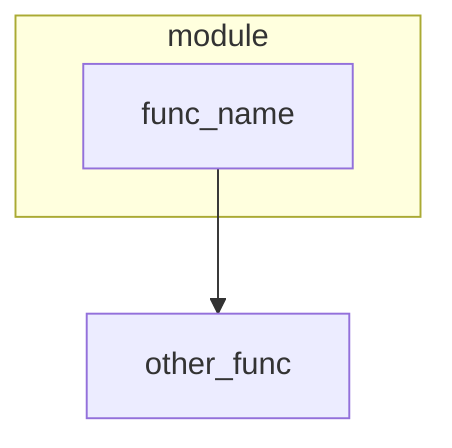

# code2flow Documentation

## Overview

code2flow is a high-performance Python code analysis tool with integrated NLP processing for intelligent code queries.

## Installation

```bash
pip install code2flow
```

## Quick Start

### Code Analysis

```python
from code2flow import ProjectAnalyzer, FAST_CONFIG

# Analyze a Python project
analyzer = ProjectAnalyzer(FAST_CONFIG)
result = analyzer.analyze_project('/path/to/project')

print(f"Functions: {result.get_function_count()}")
print(f"Classes: {result.get_class_count()}")
print(f"Patterns: {len(result.patterns)}")
```

### NLP Query Processing

```python
from code2flow import NLPPipeline, FAST_NLP_CONFIG

# Process natural language queries
pipeline = NLPPipeline(FAST_NLP_CONFIG)
result = pipeline.process("find function process_data")

print(f"Intent: {result.get_intent()}")
print(f"Confidence: {result.overall_confidence}")
print(f"Action: {result.action_recommendation}")
```

## Core Components

### 1. ProjectAnalyzer

Main analyzer for Python codebases with performance optimizations.

```python
from code2flow import ProjectAnalyzer, Config, FAST_CONFIG

# Fast analysis (recommended for large projects)
analyzer = ProjectAnalyzer(FAST_CONFIG)

# Detailed analysis
config = Config(
    mode='hybrid',
    performance=PerformanceConfig(
        fast_mode=False,
        skip_data_flow=False,
        parallel_workers=4
    )
)
analyzer = ProjectAnalyzer(config)
```

**Features:**
- **Caching**: AST parsing results cached by content hash
- **Parallel Processing**: Multi-core file analysis
- **Filtering**: Skip tests, private methods, properties
- **Depth Limiting**: Prevent CFG explosion on complex code

### 2. NLPPipeline

Natural language processing for code queries.

```python
from code2flow import NLPPipeline, NLPConfig

# Custom configuration
config = NLPConfig(
    normalization=NormalizationConfig(
        lowercase=True,
        remove_punctuation=True,
        unicode_normalize=True
    ),
    intent_matching=IntentMatchingConfig(
        fuzzy_threshold=0.8,
        keyword_weight=0.6
    )
)

pipeline = NLPPipeline(config)
```

**Pipeline Stages:**
1. **Normalization** (1a-1e): Lowercase, punctuation removal, unicode normalization
2. **Intent Matching** (2a-2e): Fuzzy matching, keyword matching, context scoring
3. **Entity Resolution** (3a-3e): Type extraction, disambiguation, alias resolution
4. **Integration** (4a-4e): Orchestration, confidence scoring, fallback handling

### 3. Configuration

#### Analysis Configuration

```python
from code2flow.core.config import (
    Config, FAST_CONFIG, PerformanceConfig,
    FilterConfig, DepthConfig
)

# Performance settings
perf = PerformanceConfig(
    enable_cache=True,
    cache_dir='.code2flow_cache',
    parallel_workers=8,
    max_nodes_per_file=1000,
    fast_mode=True
)

# Filtering settings
filters = FilterConfig(
    exclude_tests=True,
    skip_private=True,
    skip_properties=True,
    min_function_lines=3
)

# Depth settings
depths = DepthConfig(
    max_cfg_depth=3,
    max_call_depth=2
)
```

#### NLP Configuration

```python
from code2flow.nlp.config import (
    NLPConfig, FAST_NLP_CONFIG, PRECISE_NLP_CONFIG,
    NormalizationConfig, IntentMatchingConfig
)

# Load from YAML
config = NLPConfig.from_yaml('nlp_config.yaml')

# Or create programmatically
config = NLPConfig(
    normalization=NormalizationConfig(
        lowercase=True,
        remove_punctuation=True
    ),
    intent_matching=IntentMatchingConfig(
        fuzzy_threshold=0.85,
        fuzzy_algorithm='token_sort_ratio'
    )
)
```

## API Reference

### Core Module

#### `ProjectAnalyzer`

```python
class ProjectAnalyzer:
    def __init__(self, config: Optional[Config] = None)
    def analyze_project(self, project_path: str) -> AnalysisResult
```

#### `AnalysisResult`

```python
@dataclass
class AnalysisResult:
    project_path: str
    analysis_mode: str
    functions: Dict[str, FunctionInfo]
    classes: Dict[str, ClassInfo]
    patterns: List[Pattern]
    stats: Dict[str, int]
    
    def get_function_count(self) -> int
    def get_class_count(self) -> int
    def to_dict(self, compact: bool = True) -> dict
```

### NLP Module

#### `NLPPipeline`

```python
class NLPPipeline:
    def __init__(self, config: Optional[NLPConfig] = None)
    def process(self, query: str, language: str = "en") -> NLPPipelineResult
```

#### `QueryNormalizer`

```python
class QueryNormalizer:
    def normalize(self, query: str, language: str = "en") -> NormalizationResult
    
    # Individual steps
    def step_1a_lowercase(self, text: str) -> str
    def step_1b_remove_punctuation(self, text: str) -> str
    def step_1c_normalize_whitespace(self, text: str) -> str
    def step_1d_unicode_normalize(self, text: str) -> str
    def step_1e_remove_stopwords(self, text: str, language: str) -> str
```

#### `IntentMatcher`

```python
class IntentMatcher:
    def match(self, query: str, context: Optional[List[str]] = None) -> IntentMatchingResult
    
    # Individual steps
    def step_2a_fuzzy_match(self, query: str, phrase: str) -> float
    def step_2c_keyword_match(self, query: str, phrase: str) -> float
    def step_2d_context_score(self, query: str, context: List[str]) -> float
```

#### `EntityResolver`

```python
class EntityResolver:
    def resolve(
        self,
        query: str,
        context: Optional[str] = None,
        expected_types: Optional[List[str]] = None
    ) -> EntityResolutionResult
    
    def load_from_analysis(self, analysis_result: AnalysisResult) -> None
```

## CLI Usage

```bash
# Basic analysis
code2flow /path/to/project

# With options
code2flow /path/to/project \
    -v \
    -o ./output \
    --format yaml,json,mermaid

# Fast mode
code2flow /path/to/project --fast

# LLM flow generation
code2flow llm-flow /path/to/project
```

## Multilingual Support

The NLP pipeline supports multiple languages with fuzzy matching:

```python
# English queries
pipeline.process("find function", language="en")
pipeline.process("show call graph", language="en")

# Polish queries
pipeline.process("znajdź funkcję", language="pl")
pipeline.process("pokaż graf wywołań", language="pl")
```

**Supported Intents:**
- `find_function` - Find functions by name
- `find_class` - Find classes by name
- `analyze_flow` - Analyze control flow
- `show_call_graph` - Generate call graph
- `find_dependencies` - Find dependencies
- `explain_code` - Explain code functionality

## Performance Tips

### For Large Projects (>1000 functions)

```python
# Use fast config
from code2flow import FAST_CONFIG

FAST_CONFIG.performance.parallel_enabled = False  # If issues
FAST_CONFIG.filters.skip_private = True
FAST_CONFIG.depth.max_cfg_depth = 2
```

### Caching

```python
# Enable caching for repeated analysis
config = Config()
config.performance.enable_cache = True
config.performance.cache_dir = '.code2flow_cache'
```

### Parallel Processing

```python
# Use multiple workers
config = Config()
config.performance.parallel_enabled = True
config.performance.parallel_workers = 8
```

## Output Formats

### YAML

```yaml
project_path: /path/to/project
analysis_mode: hybrid
stats:
  files_processed: 197
  functions_found: 1473
  classes_found: 398
functions:
  module.func_name:
    name: func_name
    qualified_name: module.func_name
    line: 42
    calls: [other.func]
```

### Mermaid



### JSON

```json
{
  "project_path": "/path/to/project",
  "functions": {
    "module.func_name": {
      "name": "func_name",
      "line": 42
    }
  }
}
```

## Testing

```bash
# Run all tests
pytest tests/

# Run specific test file
pytest tests/test_analyzer.py -v

# Run with coverage
pytest tests/ --cov=code2flow --cov-report=html
```

## Contributing

1. Fork the repository
2. Create feature branch
3. Add tests for new features
4. Ensure all tests pass
5. Submit pull request

## License

MIT License - See LICENSE file for details.
