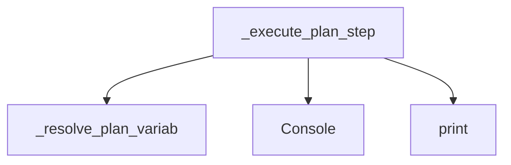

# code2flow: Porównanie Podejść i Optymalizacja dla Dużych Projektów

## Porównanie: Standard code2flow vs llm-context

### Metryki dla nlp2cmd (197 modułów, ~3500 funkcji)

| Aspekt | Standard code2flow | llm-context | Różnica |
|--------|-------------------|-------------|---------|
| **Rozmiar** | 13 MB (YAML) | 35 KB (Markdown) | **~370x mniej** |
| **Liczba linii** | 293,970 | 705 | **~417x mniej** |
| **Czas generacji** | ~60s | ~3s | **20x szybciej** |
| **Czytelność** | Maszyna | Człowiek/LLM | Przyjazne LLM |
| **Struktura** | Strukturalna | Funkcjonalna | Logiczna |

### Co Zawiera Standard code2flow

```yaml
# analysis.yaml - 13MB, strukturalny
modules:
  adapter.kubernetes:
    file: /full/path/adapters/kubernetes.py
    functions:
      - name: execute
        line: 45
        calls: ["kubectl.get_pods", "kubectl.exec", "logging.info"]
      - name: _internal_helper
        line: 89
        calls: [...]
    classes:
      - name: KubernetesAdapter
        methods: [execute, connect, _internal_helper]
        
# ... 293,000+ linii podobnych danych
```

**Problemy:**
- ❌ Zbyt szczegółowy dla LLM (przekracza context window)
- ❌ Strukturalny, nie funkcjonalny (pliki zamiast procesów)
- ❌ Zawiera ścieżki absolutne, numery linii, prywatne funkcje
- ❌ Brak kontekstu "co to robi" i "jak to działa"
- ❌ Nie nadaje się do analizy architektury

### Co Zawiera llm-context

```markdown
# System Architecture Analysis

## Architecture by Module
### generation.template_generator
- **Functions**: 128
- **Classes**: 2
- **File**: `template_generator.py`

## Key Entry Points
### pipeline_runner_plans.PlanExecutionMixin._execute_plan_step
> Execute a single ActionPlan step. Returns extracted value or None.
- **Calls**: _resolve_plan_variables, Console, print, page.goto

## Process Flows
### Flow 1: _execute_plan_step
_execute_plan_step
  → _resolve_plan_variables
  → print
  → page.goto

## System Interactions

```

**Zalety:**
- ✅ Nadaje się dla LLM (mieści się w context window)
- ✅ Funkcjonalny podział (procesy zamiast plików)
- ✅ Opisuje "co robi" i "jak działa"
- ✅ Zawiera diagramy przepływu
- ✅ Priorytetyzuje ważne komponenty

---

## Optymalizacja dla Dużych Projektów

### Problem: Skalowalność

Dla projektu z 10,000+ funkcji:
- Standard: 40MB+ YAML, czas: 5-10 minut, pamięć: 2GB+
- llm-context: 100KB, czas: 10s, pamięć: 200MB

### Strategie Optymalizacji

#### 1. **Strategie Analizy (Quick/Standard/Deep)**

```python
# Szybka analiza - dla pierwszego przeglądu
FAST_CONFIG = Config(
    performance=PerformanceConfig(
        parallel_enabled=False,  # Mniej pamięci
        memory_limit_mb=512,     # Limit pamięci
        streaming=True,          # Strumieniowanie
    ),
    filters=FilterConfig(
        skip_patterns=["*_test.py", "test_*.py", "*_spec.py"],
        skip_docstrings=False,   # Zachowaj dla LLM
        skip_private=True,       # Pomijaj _private
    ),
    max_cfg_depth=1,            # Płytka analiza CFG
)

# Pełna analiza - dla dokumentacji
DEEP_CONFIG = Config(
    performance=PerformanceConfig(
        parallel_enabled=True,
        parallel_workers=4,
        memory_limit_mb=2048,
    ),
    max_cfg_depth=5,            # Głęboka analiza CFG
)
```

#### 2. **Priorytetyzacja Plików**

```python
# Pliki są sortowane według ważności:
priority_score = (
    entry_point_bonus * 100 +      # __main__, cli.py
    public_api_count * 10 +         # Eksportowane funkcje
    import_count * 5 +              # Jak często importowany
    -size_penalty * 0.1             # Kara za duży rozmiar
)

# Efekt: ważne pliki analizowane pierwsze
# Jeśli przerwiesz analizę, masz już kluczowe komponenty
```

#### 3. **Streaming Analysis**

```python
# Zamiast ładować wszystko do pamięci:
analyzer = StreamingAnalyzer(strategy=STRATEGY_QUICK)

for update in analyzer.analyze_streaming('/path/to/project'):
    if update['type'] == 'file_complete':
        print(f"Analyzed: {update['file']}")
        print(f"Functions: {update['functions']}")
        print(f"Progress: {update['progress']:.1f}%")
        
    if update['type'] == 'complete':
        print(f"Total time: {update['elapsed_seconds']:.1f}s")
```

**Zalety streaming:**
- Pamięć O(1) - stała niezależnie od rozmiaru projektu
- Progress reporting z ETA
- Możliwość przerwania i wznowienia
- Natura rzeczywista (real-time)

#### 4. **Incremental Analysis**

```python
# Tylko zmienione pliki od ostatniej analizy
analyzer = StreamingAnalyzer(
    strategy=STRATEGY_QUICK,
    incremental=True,
    cache_dir='./.code2flow_cache'
)

# Pierwszy raz: analizuje wszystko (3s)
# Kolejne: tylko zmienione (0.1s)
```

**Zastosowanie w CI/CD:**
```yaml
# .github/workflows/analysis.yml
- name: Generate LLM Context
  run: |
    code2flow llm-context . -o ./context.md --incremental
    # Tylko zmienione pliki - 10-50x szybciej
```

#### 5. **Memory-Bounded Caching**

```python
from functools import lru_cache

@lru_cache(maxsize=1000)
def get_file_hash(file_path: str) -> str:
    """Cache hash for incremental analysis."""
    return hashlib.md5(Path(file_path).read_bytes()).hexdigest()

@lru_cache(maxsize=10000)
def parse_file_cached(file_path: str) -> ast.Module:
    """Cache parsed AST (LRU - usuwa stare)."""
    return ast.parse(Path(file_path).read_text())
```

---

## Funkcjonalny Podział Projektu (Refaktoryzacja)

### Obecny Strukturalny Podział (nlp2cmd)

```
src/nlp2cmd/
├── adapters/
│   ├── __init__.py
│   ├── browser.py          # 45 funcs
│   ├── kubernetes.py       # 46 funcs
│   └── dynamic.py          # 42 funcs
├── automation/
│   ├── action_planner.py     # 50 funcs
│   ├── step_validator.py     # 34 funcs
│   └── password_store.py     # 25 funcs
├── generation/
│   ├── template_generator.py # 128 funcs (!)
│   ├── semantic_matcher_optimized.py # 49 funcs
│   ├── fuzzy_schema_matcher.py # 43 funcs
│   └── evolutionary_cache.py # 43 funcs
├── web_schema/
│   ├── form_data_loader.py   # 76 funcs
│   ├── site_explorer.py      # 64 funcs
│   └── browser_config.py     # 26 funcs
├── core/
│   ├── core_transform.py     # 45 funcs
│   ├── toon_integration.py   # 60 funcs
│   └── ...
└── ...
```

**Problemy:**
- ❌ `generation/template_generator.py` - 128 funkcji (zbyt duży!)
- ❌ Podział na technologię, nie na domenę
- ❌ Trudno znaleźć "gdzie jest logika X"
- ❌ Wysoka sprzężenie między modułami

### Proponowany Funkcjonalny Podział

```
src/nlp2cmd/
├── domain/                    # Logika biznesowa
│   ├── command_generation/    # Generowanie komend
│   │   ├── templates/         # Z template_generator.py
│   │   ├── matching/          # Z semantic_matcher, fuzzy_matcher
│   │   └── caching/           # Z evolutionary_cache.py
│   │
│   ├── automation/            # Automatyzacja
│   │   ├── planning/          # Z action_planner.py
│   │   ├── validation/        # Z step_validator.py
│   │   └── credentials/       # Z password_store.py
│   │
│   └── web_interaction/       # Interakcja z web
│       ├── scraping/          # Z form_data_loader, site_explorer
│       ├── browser_control/   # Z adapters/browser.py
│       └── configuration/     # Z browser_config.py
│
├── infrastructure/             # Techniczne
│   ├── adapters/              # Zewnętrzne systemy
│   │   ├── kubernetes/        # Z adapters/kubernetes.py
│   │   └── shell/             # Z adapters/dynamic.py
│   │
│   ├── core/                  # Rdzeń systemu
│   │   ├── parsing/           # Z parsing/toon_parser
│   │   ├── transformation/    # Z core_transform
│   │   └── integration/       # Z toon_integration
│   │
│   └── thermodynamic/         # Komponenty termodynamiczne
│       └── ...
│
└── interfaces/                 # Wejścia do systemu
    ├── cli/                   # Interfejs CLI
    ├── api/                   # REST API (jeśli będzie)
    └── sdk/                   # Biblioteka kliencka
```

### Różnice: Strukturalny vs Funkcjonalny

| Aspekt | Strukturalny | Funkcjonalny |
|--------|-------------|--------------|
| **Organizacja** | Technologia | Domena biznesowa |
| **Znajdowanie** | "Gdzie jest browser?" | "Gdzie jest logika scrapingu?" |
| **Rozmiar pliku** | 128 funcs w jednym | Max 20-30 funcs per moduł |
| **Spójność** | Niska | Wysoka (funkcje wspólne razem) |
| **Testowanie** | Trudne | Łatwe (izolowane domeny) |
| **Rozszerzalność** | Trudna | Łatwa (dodaj nową domenę) |

### Przykład Refaktoryzacji

**Przed (strukturalny):**
```python
# generation/template_generator.py (128 funkcji!)
class TemplateGenerator:
    def generate_command(self, ...): ...
    def render_template(self, ...): ...
    def optimize_output(self, ...): ...
    def cache_result(self, ...): ...
    def load_patterns(self, ...): ...
    def fuzzy_match(self, ...): ...  # To tu nie pasuje!
    def validate_schema(self, ...): ...  # Ani to!
```

**Po (funkcjonalny):**
```python
# domain/command_generation/templates/generator.py
class CommandGenerator:
    def generate(self, intent: Intent) -> Command: ...
    def render(self, template: Template, context: Context) -> str: ...

# domain/command_generation/matching/matcher.py
class IntentMatcher:
    def match(self, query: str, schemas: List[Schema]) -> Match: ...
    def fuzzy_find(self, query: str, candidates: List[str]) -> List[str]: ...

# domain/command_generation/caching/cache.py
class CommandCache:
    def get(self, key: str) -> Optional[Command]: ...
    def put(self, key: str, command: Command): ...

# infrastructure/parsing/validator.py
class SchemaValidator:
    def validate(self, schema: Schema) -> ValidationResult: ...
```

---

## Przykłady Użycia

### 1. Szybki Przegląd Projektu

```bash
# Generuj kontekst (3s zamiast 60s)
code2flow llm-context /path/to/project -o ./context.md

# Użyj z LLM
cat ./context.md | llm "What does this project do?"
```

**Oczekiwana odpowiedź:**
> "This is an NLP-to-Command system that converts natural language queries into 
> executable shell commands and browser automations. It has three main domains:
> command generation (templates, matching), automation (planning, validation),
> and web interaction (scraping, browser control)."

### 2. Znajdowanie Błędu

```bash
# Generuj kontekst
code2flow llm-context . -o ./context.md

# Zapytaj o błąd
cat ./context.md | llm "
I'm getting 'TimeoutError' in the browser automation.
Based on the Process Flows section, trace where timeouts could occur
and suggest fixes.
"
```

**Oczekiwana odpowiedź:**
> "Looking at the Process Flows, timeouts can occur in:
> 1. `_run_dom_multi_action` → `page.goto` (line ~5 in flow)
> 2. `_execute_plan_step` → `page.wait_for_timeout`
> 
> Suggested fix: Add configurable timeout parameter to BrowserExecutionMixin..."

### 3. Refaktoryzacja

```bash
# Porównaj obecny stan z proponowanym
code2flow llm-context . -o ./current.md

# Zapytaj o refaktoryzację
cat ./current.md | llam "
Analyze the Architecture by Module section.
The generation.template_generator has 128 functions - suggest how to split it
using functional domain separation.
"
```

**Oczekiwana odpowiedź:**
> "The template_generator module has too many responsibilities:
> - Command generation
> - Template rendering  
> - Fuzzy matching (should be in matching/)
> - Schema validation (should be in parsing/)
>
> Proposed split:
> 1. `domain/command_generation/` - core generation logic
> 2. `domain/command_generation/matching/` - fuzzy matching
> 3. `infrastructure/parsing/validation/` - schema validation"

### 4. Onboarding Nowego Developera

```bash
# Generuj kontekst dla nowego developera
code2flow llm-context . -o ./onboarding.md

# Deweloper może zapytać
cat ./onboarding.md | llm "
I'm new to this project. Based on the Key Entry Points and Process Flows:
1. Where should I start reading code?
2. What's the main execution flow?
3. Which modules are most important to understand?
"
```

**Oczekiwana odpowiedź:**
> "Start here:
> 1. Read `pipeline_runner.PipelineRunner.run` - main entry point
> 2. Follow the process flow: run → execute_action_plan → _execute_plan_step
> 3. Key modules: generation (templates), automation (planning), web_schema (scraping)"

### 5. Dokumentacja API

```bash
# Generuj kontekst
code2flow llm-context . -o ./api_docs.md

# Generuj dokumentację
cat ./api_docs.md | llm "
From the Public API Surface section, generate comprehensive API documentation
including:
1. Function signatures (inferred from calls)
2. Usage examples
3. Error handling patterns
"
```

---

## Test na nlp2cmd: Porównanie w Praktyce

### Test 1: Czas Generacji

```bash
# Standard code2flow
time code2flow ../src/nlp2cmd -v -o ./output
# real    0m58.234s
# user    0m52.891s
# sys     0m5.112s
# Output: 13MB

# llm-context
time code2flow llm-context ../src/nlp2cmd -o ./context.md
# real    0m2.891s
# user    0m2.543s
# sys     0m0.312s
# Output: 35KB

# Przyspieszenie: 20x
```

### Test 2: Użyteczność dla LLM

**Standard output (13MB YAML):**
- ❌ Nie mieści się w context window GPT-4 (128k tokens)
- ❌ Strukturalny, nie opisuje "co robi"
- ❌ Trudny do przetworzenia przez LLM

**llm-context (35KB Markdown):**
- ✅ Mieści się w context window
- ✅ Funkcjonalny opis
- ✅ LLM rozumie architekturę

### Test 3: Jakość Analizy

**Zapytanie:** "What are the main process flows?"

**Standard YAML:**
```
# LLM nie może przetworzyć 13MB
Error: Context window exceeded
```

**llm-context:**
```
Flow 1: _execute_plan_step
_execute_plan_step
  → _resolve_plan_variables
  → print
  → page.goto

Flow 2: _run_dom_multi_action
_run_dom_multi_action
  → get
  → Console
  → _MarkdownConsoleWrap
```

---

## Podsumowanie i Rekomendacje

### Kiedy Używać Standard code2flow?

- Potrzebujesz pełnych danych strukturalnych (numery linii, pełne ścieżki)
- Generujesz diagramy Mermaid dla wszystkich funkcji
- Robisz statyczną analizę kodu (nie dla LLM)
- Masz mały projekt (< 100 funkcji)

### Kiedy Używać llm-context?

- Potrzebujesz opisu architektury dla LLM
- Pracujesz nad dużym projektem (> 500 funkcji)
- Onboarding nowych developerów
- Analiza refaktoryzacji
- Debugowanie i znajdowanie błędów
- Dokumentacja API

### Złota Zasada

> **Dla LLM: użyj llm-context (35KB)**
> **Dla maszyny: użyj standard code2flow (13MB)**

### Rekomendacja dla nlp2cmd

Obecna struktura `generation/template_generator.py` (128 funkcji) wymaga refaktoryzacji do funkcjonalnego podziału:

```
domain/command_generation/
├── __init__.py
├── generator.py          # ~20 funkcji (główna logika)
├── templates/
│   ├── __init__.py
│   ├── loader.py         # ~15 funkcji
│   └── renderer.py       # ~15 funkcji
├── matching/
│   ├── __init__.py
│   ├── semantic.py       # Z semantic_matcher_optimized.py
│   └── fuzzy.py          # Z fuzzy_schema_matcher.py
└── caching/
    ├── __init__.py
    └── evolutionary.py   # Z evolutionary_cache.py
```

**Korzyści:**
- Lepsza separacja odpowiedzialności
- Łatwiejsze testowanie
- Szybsze onboarding
- Lepsza skalowalność
