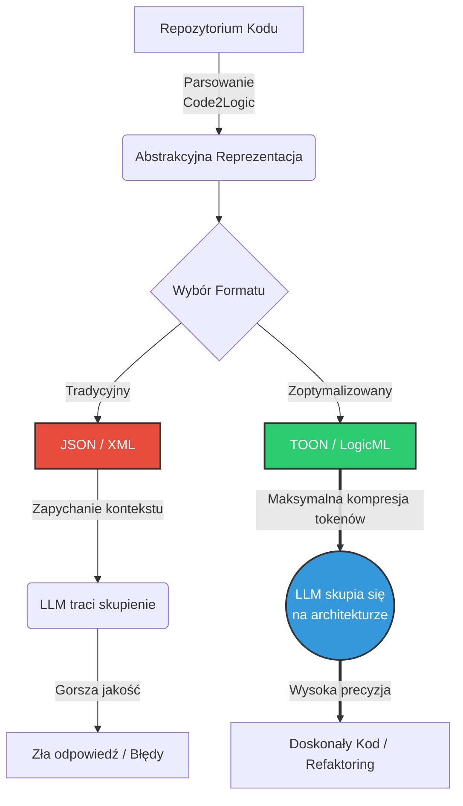

użyty diagram w formacie mermaid

```mermaid
graph TD
    A[Repozytorium Kodu] -->|Parsowanie<br/>Code2Logic| B(Abstrakcyjna Reprezentacja)
    B --> C{Wybór Formatu}
    
    C -->|Tradycyjny| D[JSON / XML]
    D -->|Zapychanie kontekstu| E(LLM traci skupienie)
    E -->|Gorsza jakość| F[Zła odpowiedź / Błędy]
    
    C -->|Zoptymalizowany| G[TOON / LogicML]
    G ==>|Maksymalna kompresja tokenów| H((LLM skupia się<br/>na architekturze))
    H ==>|Wysoka precyzja| I[Doskonały Kod / Refaktoring]
    
    style G fill:#2ecc71,stroke:#333,stroke-width:2px,color:white
    style H fill:#3498db,stroke:#333,stroke-width:2px,color:white
    style D fill:#e74c3c,stroke:#333,stroke-width:2px,color:white
```