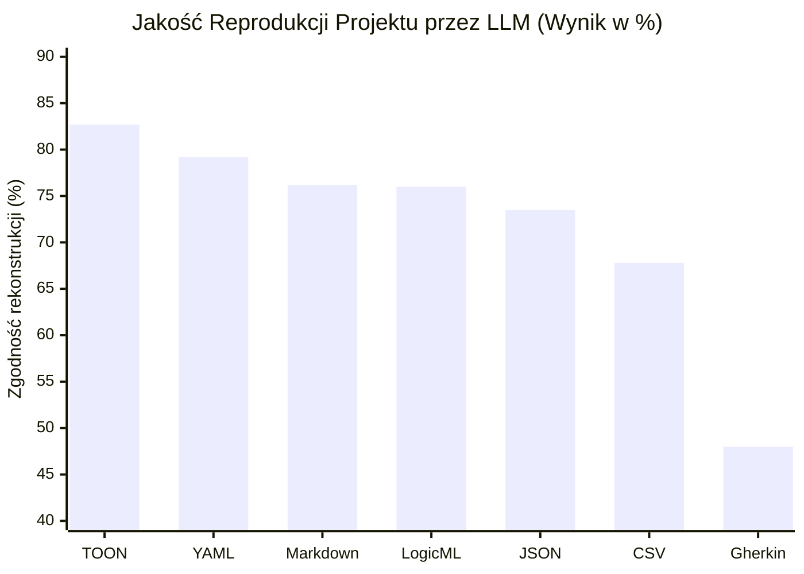

Wyniki z naszego *Project Benchmark* (Zdolność LLM do odtworzenia poprawnego strukturalnie i semantycznie kodu na bazie specyfikacji):

```mermaid
xychart-beta
    title "Jakość Reprodukcji Projektu przez LLM (Wynik w %)"
    x-axis ["TOON", "YAML", "Markdown", "LogicML", "JSON", "CSV", "Gherkin"]
    y-axis "Zgodność rekonstrukcji (%)" 40 --> 90
    bar [82.7, 79.2, 76.2, 76.0, 73.5, 67.8, 48.0]
```